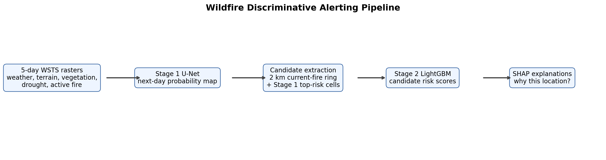
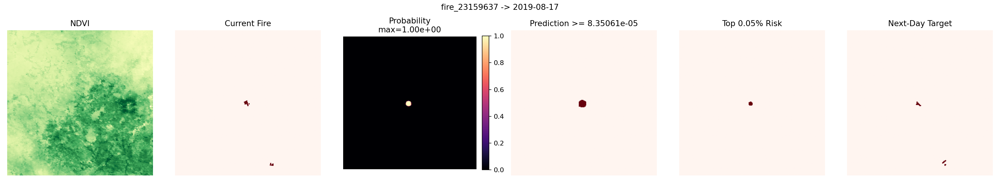
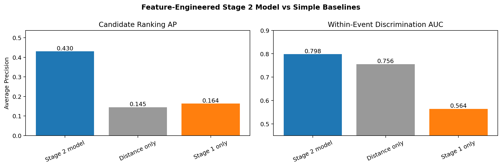
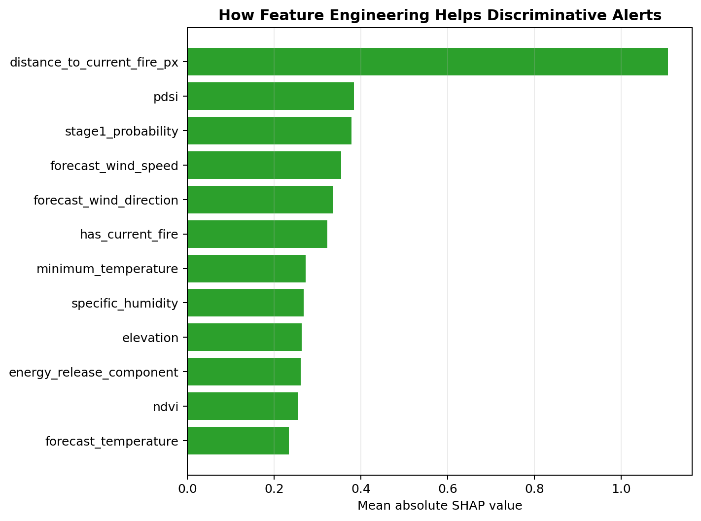
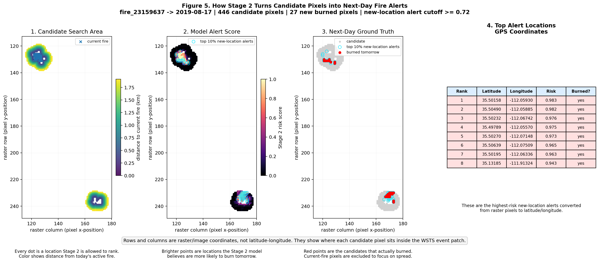
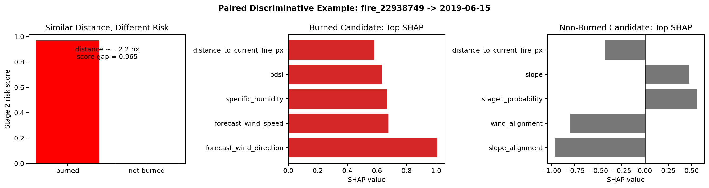

# Secondary Thesis Report: Wildfire Next-Day Discriminative Alerting

## Candidate Thesis Titles

1. **Discriminative Next-Day Wildfire Spread Alerting Using Spatiotemporal Remote Sensing and Explainable Machine Learning**
2. **Candidate-Level Wildfire Spread Alerting with Two-Stage Deep Learning and Gradient-Boosted Decision Models**
3. **Explainable One-Day-Ahead Wildfire Spread Alerts from Multimodal Remote Sensing Time Series**
4. **From Fire Spread Prediction to Location-Specific Alerts: A Two-Stage Framework for Wildfire Risk Discrimination**

## Thesis Overview

This thesis develops a **one-day-ahead wildfire spread alerting framework** using the WildfireSpreadTS dataset.

The goal is not only to predict a full fire map, but to answer a more operational question:

> Given an active fire today, which nearby locations are most likely to burn tomorrow, and why?

The implemented thesis workflow has two stages:

1. **Stage 1:** A U-Net predicts a next-day fire probability map from recent raster observations.
2. **Stage 2:** A LightGBM model ranks candidate alert locations using engineered features such as Stage 1 risk, distance, wind, terrain, vegetation, drought, and weather.

## Challenges Faced

| Challenge | Why it mattered |
|---|---|
| Extreme class imbalance | Only a very small fraction of pixels burn tomorrow, so normal accuracy is not meaningful. |
| Turning maps into alerts | A probability map alone does not directly tell decision-makers which locations should receive alerts. |
| Need for explainability | A high-risk alert should be supported by interpretable evidence. |
| Related-work gap | Prior WSTS baselines focus mainly on map prediction, not candidate-level alert ranking. |

## How the Thesis Deals with These Challenges

| Challenge | Response in this thesis |
|---|---|
| Extreme class imbalance | Used Average Precision, Dice/F1, candidate positive-rate checks, and class-weighted LightGBM training. |
| Turning maps into alerts | Added Stage 2 candidate extraction around active fire regions and Stage 1 top-risk cells. |
| Need for explainability | Added SHAP-based global and local explanations for Stage 2 alert scores. |
| Related-work gap | Converted the WSTS next-day spread task into a discriminative alerting task. |

## Dataset and Temporal Setup

The current experiment uses the **2019 WSTS data only** because of thesis time and compute constraints.

The prediction horizon is:

> **One day ahead.**

Stage 1 uses recent daily raster observations to predict the next-day active-fire map. Stage 2 then uses the latest available features plus Stage 1 risk to score candidate locations for the same next-day alert task.

## Fold Separation

The 2019 events were split by **fire event ID**, not by random pixels.

This is important because random pixel splitting would mix pixels from the same fire event into both training and validation, making the evaluation too easy.

Two event-split folds were used:

| Fold | Training events | Validation/test events | Use |
|---|---:|---:|---|
| Fold 0 | 59 | 15 | Stage 1/Stage 2 validation direction |
| Fold 1 | 59 | 15 | Reverse validation direction |

Stage 2 was evaluated in both directions:

| Direction | Meaning |
|---|---|
| Fold 0 -> Fold 1 | Train Stage 2 on fold 0 candidates, evaluate on fold 1 candidates. |
| Fold 1 -> Fold 0 | Train Stage 2 on fold 1 candidates, evaluate on fold 0 candidates. |

Held-out fire IDs:

| Fold | Fire IDs |
|---|---|
| Fold 0 | fire_22710141, fire_22938749, fire_23036871, fire_23037424, fire_23159637, fire_23159647, fire_23159789, fire_23159838, fire_23159862, fire_23160488, fire_23300839, fire_23300886, fire_23301037, fire_23301386, fire_23410619 |
| Fold 1 | fire_22863125, fire_22938746, fire_23036565, fire_23037424, fire_23159637, fire_23159647, fire_23159838, fire_23159842, fire_23159855, fire_23159860, fire_23300665, fire_23300699, fire_23301046, fire_23301386, fire_23572745 |

## Stage 1: Next-Day Fire Spread Prediction

Stage 1 produces a next-day probability map. This gives the thesis a learned spatial risk signal before candidate-level alert ranking.

Key Stage 1 results:

| Fold | Best validation AP | Best Dice | Best IoU |
|---|---:|---:|---:|
| Fold 0 | 0.0872 | 0.2311 | 0.1307 |
| Fold 1 | 0.0927 | 0.2093 | 0.1169 |

Stage 1 was useful as a **risk-ranking signal**, but not strong enough alone for the final alerting claim. This motivated Stage 2.

## Stage 2: Candidate-Level Discriminative Alerting

Stage 2 converts the problem from dense segmentation into candidate-level alert ranking.

Candidate locations came from:

1. A **2 km search ring** around current active fire pixels.
2. Stage 1 top-risk cells.

The 2 km range was selected because a 5 km range produced too many easy negative examples far from the fire. The 2 km range focuses the model on realistic short-term spread locations and forces it to make more precise distinctions.

Fair candidate statistics:

| Fold | Candidates | Positive candidates | Positive rate |
|---|---:|---:|---:|
| Fold 0 | 51,330 | 3,269 | 6.37% |
| Fold 1 | 35,136 | 1,930 | 5.49% |

## Stage 2 Results

Stage 2 performed better than simple baselines.

| Direction | Model AP | Distance AP | Stage 1 AP | Model within-event AUC |
|---|---:|---:|---:|---:|
| Fold 0 -> Fold 1 | 0.3940 | 0.1933 | 0.1527 | 0.7992 |
| Fold 1 -> Fold 0 | 0.4301 | 0.1451 | 0.1635 | 0.7980 |

Interpretation:

- AP improved strongly over distance-only and Stage-1-only ranking.
- Within-event AUC near **0.80** means the model usually ranks burned candidates above unburned candidates within the same fire event-day.
- This supports the thesis claim that feature-engineered Stage 2 alerts are more discriminative than a raw probability map or simple distance rule.

## How Feature Engineering Helped

Stage 2 uses candidate-level features rather than only image pixels.

Important feature groups:

| Feature group | Why it helps |
|---|---|
| Stage 1 probability | Carries learned spread-risk information from the U-Net. |
| Distance to current fire | Represents local spread feasibility. |
| Wind speed/direction/alignment | Captures likely direction of fire movement. |
| Terrain and slope/aspect | Represents physical spread conditions. |
| Vegetation indices | Represents available fuel. |
| Drought and humidity | Represents dryness and burn potential. |

SHAP analysis shows which engineered features influenced the model most.

## Alert Visualization with GPS Coordinates

The final alert map shows how the thesis moves from raster coordinates to practical alert locations.

The right-hand table converts top-risk raster pixels into latitude and longitude using the stored CRS and affine transform metadata.

Example high-alert locations:

| Rank | Latitude | Longitude | Risk | Burned tomorrow? |
|---:|---:|---:|---:|---|
| 1 | 35.50158 | -112.05930 | 0.983 | yes |
| 2 | 35.50490 | -112.05885 | 0.982 | yes |
| 3 | 35.50232 | -112.06742 | 0.976 | yes |
| 4 | 35.49789 | -112.05570 | 0.975 | yes |

The full table is saved at:

`outputs/figures/final_pipeline/05_stage2_high_alert_locations.csv`

## Similar-Distance Discrimination

A key thesis idea is that two candidate locations can be similarly close to the fire but still deserve different alert scores.

This figure supports the discriminative alerting claim:

- The model does not only use distance.
- It combines distance with Stage 1 risk, wind, terrain, drought, vegetation, and weather.
- SHAP explains why one candidate receives a higher alert score than another.

## Limitations

This thesis prototype is intentionally scoped.

| Limitation | Meaning |
|---|---|
| 2019-only experiment | The current results are proof-of-concept, not a full multi-year benchmark. |
| Event-split validation only | Stronger future validation should include year-based generalization. |
| Stage 1 remains modest | The segmentation model is useful, but Stage 2 is responsible for stronger alert ranking. |
| Operational deployment not included | The thesis demonstrates alert logic, not a live emergency-response system. |

## Final Contributions

The main contributions of this thesis are:

1. A two-stage wildfire alerting framework that converts WSTS raster sequences into next-day candidate alert scores.
2. A Stage 1 U-Net spread-prediction model that provides learned spatial risk maps.
3. A candidate-level Stage 2 alert model that combines Stage 1 output with physical and environmental features.
4. A class-imbalance-aware training setup using event-level splits, AP-based evaluation, and balanced LightGBM learning.
5. A discriminative evaluation showing that Stage 2 outperforms distance-only and Stage-1-only baselines.
6. SHAP-based explanations showing which features drive alert scores globally and locally.
7. A practical alert visualization that converts top-risk pixels into latitude/longitude alert locations.

## Short Thesis Statement

This thesis demonstrates that next-day wildfire spread prediction can be reframed as a discriminative alerting problem: instead of only producing a probability map, the system ranks nearby candidate locations, explains the ranking with engineered physical features, and converts high-risk candidates into practical GPS-based alert locations.
